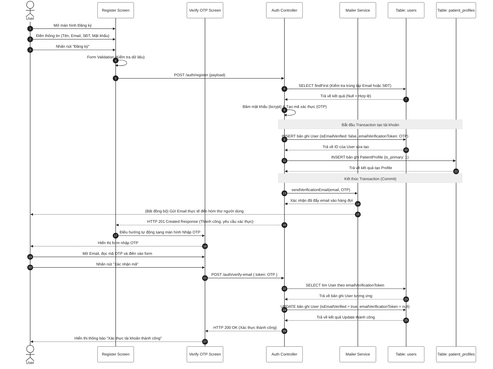

# Register & OTP Verification Sequence Diagram

```mermaid
%%{init: {'theme': 'base', 'themeVariables': {'background': '#ffffff', 'primaryColor': '#ffffff', 'primaryBorderColor': '#333333', 'primaryTextColor': '#222222', 'secondaryColor': '#ffffff', 'tertiaryColor': '#ffffff', 'lineColor': '#555555', 'textColor': '#222222', 'noteBkgColor': '#eeeeee', 'noteTextColor': '#333333', 'activationBorderColor': '#333333', 'activationBkgColor': '#f0f0f0', 'sequenceNumberColor': '#ffffff'}}}%%
sequenceDiagram
    autonumber
    actor User
    participant RS as Register Screen
    participant OS as Verify OTP Screen
    participant AC as Auth Controller
    participant MS as Mailer Service
    participant TU as Table: users
    participant TP as Table: patient_profiles

    User->>RS: Mở màn hình Đăng ký
    User->>RS: Điền thông tin (Tên, Email, SĐT, Mật khẩu)
    User->>RS: Nhấn nút "Đăng ký"
    RS->>RS: Form Validation (Kiểm tra dữ liệu)
    RS->>AC: POST /auth/register (payload)
    AC->>TU: SELECT findFirst (Kiểm tra trùng lặp Email hoặc SĐT)
    TU-->>AC: Trả về kết quả (Null = Hợp lệ)
    AC->>AC: Băm mật khẩu (bcrypt) & Tạo mã xác thực (OTP)

    Note over AC,TP: Bắt đầu Transaction tạo tài khoản

    AC->>TU: INSERT bản ghi User (isEmailVerified: false, emailVerificationToken: OTP)
    TU-->>AC: Trả về ID của User vừa tạo
    AC->>TP: INSERT bản ghi PatientProfile (is_primary: 1)
    TP-->>AC: Trả về kết quả tạo Profile

    Note over AC,TP: Kết thúc Transaction (Commit)

    AC->>MS: sendVerificationEmail(email, OTP)
    MS-->>AC: Xác nhận đã đẩy email vào hàng đợi
    MS-->>User: (Bất đồng bộ) Gửi Email thực tế đến hòm thư người dùng
    AC-->>RS: HTTP 201 Created Response (Thành công, yêu cầu xác thực)
    RS->>OS: Điều hướng tự động sang màn hình Nhập OTP
    OS-->>User: Hiển thị form nhập OTP

    User->>OS: Mở Email, đọc mã OTP và điền vào form
    User->>OS: Nhấn nút "Xác nhận mã"
    OS->>AC: POST /auth/verify-email { token: OTP }
    AC->>TU: SELECT tìm User theo emailVerificationToken
    TU-->>AC: Trả về bản ghi User tương ứng
    AC->>TU: UPDATE bản ghi User (isEmailVerified = true, emailVerificationToken = null)
    TU-->>AC: Trả về kết quả Update thành công
    AC-->>OS: HTTP 200 OK (Xác thực thành công)
    OS-->>User: Hiển thị thông báo "Xác thực tài khoản thành công"
```
