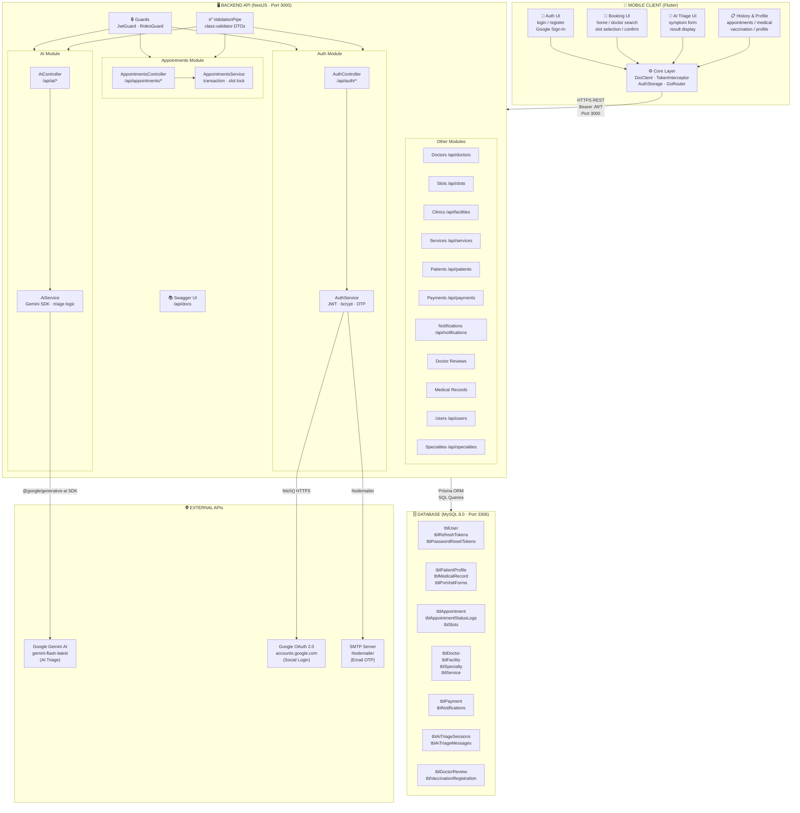

# Kiến Trúc Tổng Quan – Dự Án `clinic-ai-booking`
> Mức nhóm · Toàn dự án · Cập nhật: 2026-05-22

---

## 1. Sơ Đồ Kiến Trúc Tổng Thể



---

## 2. Mô Tả Từng Khối

### 📱 Khối 1 – Mobile Client (Flutter)

| Thành phần | Vai trò | Công nghệ |
|---|---|---|
| **Auth UI** | Màn hình đăng nhập, đăng ký, Google Sign-In | Flutter Widget, `google_sign_in` |
| **Booking UI** | Trang chủ, tìm bác sĩ, chọn slot, xác nhận lịch | Flutter, `go_router` |
| **AI Triage UI** | Form 5 bước nhập triệu chứng, hiển thị kết quả AI | Flutter Widget, `AiService` |
| **History & Profile** | Lịch sử lịch hẹn, hồ sơ bệnh án, tiêm chủng, thông tin cá nhân | Flutter |
| **DioClient** | HTTP client trung tâm – tự động gắn JWT, tự refresh token khi hết hạn, retry 3 lần | `dio`, `dio_smart_retry` |
| **TokenInterceptor** | Bắt lỗi 401 → gọi `/auth/refresh` → retry request gốc | `flutter_secure_storage` |
| **AuthStorage** | Lưu trữ `access_token` + `refresh_token` + thông tin user | `flutter_secure_storage` / `shared_preferences` (web) |
| **GoRouter** | Điều hướng toàn ứng dụng (`/login`, `/booking`, `/ai-triage`,...) | `go_router` |

**Cấu hình kết nối:**
```dart
// lib/core/config/api_config.dart
const String baseUrl = 'http://127.0.0.1:3000/api';
// Android Emulator: 10.0.2.2:3000
// Thiết bị thật: IP LAN máy tính
```

---

### 🖥️ Khối 2 – Backend API (NestJS)

**Cổng:** `3000` · **Global prefix:** `/api` · **Swagger:** `/api/docs`

| Module | Controller Route | Chức năng chính | Người phụ trách |
|---|---|---|---|
| **Auth** | `/api/auth` | Đăng ký, đăng nhập, Google OAuth, JWT, OTP reset | *(chức năng được phân công)* |
| **Appointments** | `/api/appointments` | Đặt lịch, quản lý lịch hẹn, transaction slot | *(chức năng được phân công)* |
| **AI** | `/api/ai` | Triage triệu chứng qua Gemini, pre-visit summary | *(chức năng được phân công)* |
| **Doctors** | `/api/doctors` | Danh sách bác sĩ, lọc theo chuyên khoa, profile |  |
| **Slots** | `/api/slots` | Quản lý khung giờ khám, kiểm tra trống/đầy |  |
| **Clinics** | `/api/facilities` | Thông tin cơ sở y tế, bệnh viện, phòng khám |  |
| **Services** | `/api/services` | Dịch vụ khám, dịch vụ vaccine, bảng giá |  |
| **Patients** | `/api/patients` | Hồ sơ bệnh nhân, hồ sơ phụ (thành viên gia đình) |  |
| **Medical Records** | `/api/medical-records` | Hồ sơ bệnh án sau khám, chẩn đoán, đơn thuốc |  |
| **Payments** | `/api/payments` | Thanh toán, VNPay, MoMo, ZaloPay |  |
| **Notifications** | `/api/notifications` | Thông báo đẩy, nhắc lịch, FCM |  |
| **Doctor Reviews** | *(reviews)* | Đánh giá bác sĩ sau khám, rating |  |
| **Specialties** | `/api/specialties` | Danh mục chuyên khoa y tế |  |
| **Users** | `/api/users` | Quản lý tài khoản user, avatar |  |

**Cơ chế bảo mật:**
```
Mọi route (trừ /auth/login, /auth/register) đều yêu cầu:
  Header: Authorization: Bearer <JWT access_token>
  JWT payload: { sub: user_id, email, role }
  Guard: JwtGuard (xác thực) + RolesGuard (phân quyền role)
```

---

### 🗄️ Khối 3 – Database (MySQL 8.0)

**Kết nối:** Prisma ORM · **Port:** `3306` · **DB name:** `clinic_ai`

```
Nhóm bảng theo chức năng:

┌─ Người dùng & Bảo mật ─────────────────────────────┐
│  tblUser · tblRefreshTokens · tblPasswordResetTokens │
└────────────────────────────────────────────────────-─┘
┌─ Hồ sơ Y tế ───────────────────────────────────────┐
│  tblPatientProfile · tblMedicalRecord               │
│  tblPreVisitForms · tblVaccinationRegistration       │
└─────────────────────────────────────────────────────┘
┌─ Lịch hẹn & Quy trình ─────────────────────────────┐
│  tblAppointment · tblSlots · tblAppointmentStatusLogs│
└─────────────────────────────────────────────────────┘
┌─ Cơ sở & Nhân sự ──────────────────────────────────┐
│  tblDoctor · tblFacility · tblSpecialty · tblService │
│  tblVaccine · tblServiceVaccine                      │
└─────────────────────────────────────────────────────┘
┌─ Tài chính & Giao tiếp ────────────────────────────┐
│  tblPayment · tblNotifications · tblDoctorReview     │
└─────────────────────────────────────────────────────┘
┌─ AI Triage ─────────────────────────────────────────┐
│  tblAiTriageSessions · tblAiTriageMessages           │
└─────────────────────────────────────────────────────┘
```

---

### 🌐 Khối 4 – External APIs

| API | Nhà cung cấp | Dùng ở đâu | Cách tích hợp |
|---|---|---|---|
| **Google Gemini AI** | Google DeepMind | Backend – module `ai` | `@google/generative-ai` npm SDK |
| **Google OAuth 2.0** | Google | Backend – module `auth` | `fetch()` gọi `accounts.google.com` |
| **Google Sign-In** | Google | Mobile – `AuthService` | `google_sign_in` Flutter package |
| **SMTP / Email** | Cấu hình tự do | Backend – module `auth` | `nodemailer` npm package |

---

## 3. Luồng Giao Tiếp Chính

```
[Flutter] ──HTTPS POST──▶ [NestJS /api/auth/login]
                              │ bcrypt verify
                              │ Prisma SELECT tblUser
                              ▼
                          [MySQL tblUser]
                              │ return user data
                              ▼
                          [NestJS] tạo JWT
                              │ Prisma INSERT tblRefreshTokens
                              ▼
[Flutter] ◀── JWT tokens ─── [NestJS response]
    │ lưu vào FlutterSecureStorage
    │
    ▼ (request tiếp theo có route được bảo vệ)
[Flutter] ──Bearer JWT──▶ [JwtGuard] ──▶ [Controller] ──▶ [Service] ──▶ [Prisma] ──▶ [MySQL]
                                                                │
                                                    (nếu là /ai/triage)
                                                                │
                                                                ▼
                                                    [Google Gemini API]
                                                    trả JSON { urgency, specialty, reasoning }
                                                                │
                                                                ▼
                                                    Lưu tblAiTriageSessions
                                                                │
[Flutter] ◀── kết quả AI ─────────────────────────────────────┘
```

---

## 4. Phân Công Nhóm Theo Khối

> Điền tên thành viên vào ô tương ứng với chức năng được giao.

| Chức năng | Backend Module | Mobile Feature | Bảng DB liên quan |
|---|---|---|---|
| **Đăng ký / Đăng nhập** | `auth` | `features/auth` | tblUser, tblRefreshTokens, tblPatientProfile |
| **Đặt lịch khám** | `appointments`, `slots` | `features/booking` | tblAppointment, tblSlots |
| **AI Phỏng đoán bệnh** | `ai` | `features/ai` | tblAiTriageSessions |
| Quản lý bác sĩ | `doctors`, `specialties` | `features/booking` (search) | tblDoctor, tblSpecialty |
| Cơ sở y tế | `clinics` | `features/facilities` | tblFacility |
| Thanh toán | `payments` | *(trong booking flow)* | tblPayment |
| Hồ sơ bệnh án | `medical-records` | `features/medical_history` | tblMedicalRecord |
| Thông báo | `notifications` | — | tblNotifications |
| Đánh giá bác sĩ | `doctor-reviews` | — | tblDoctorReview |
| Hồ sơ cá nhân | `patients`, `users` | `features/profile` | tblPatientProfile |
| Tiêm chủng | `services` | `features/vaccination_booking` | tblVaccinationRegistration |

---

*Dự án: `clinic-ai-booking` · Tech Stack: Flutter + NestJS + MySQL + Prisma + Google Gemini*
