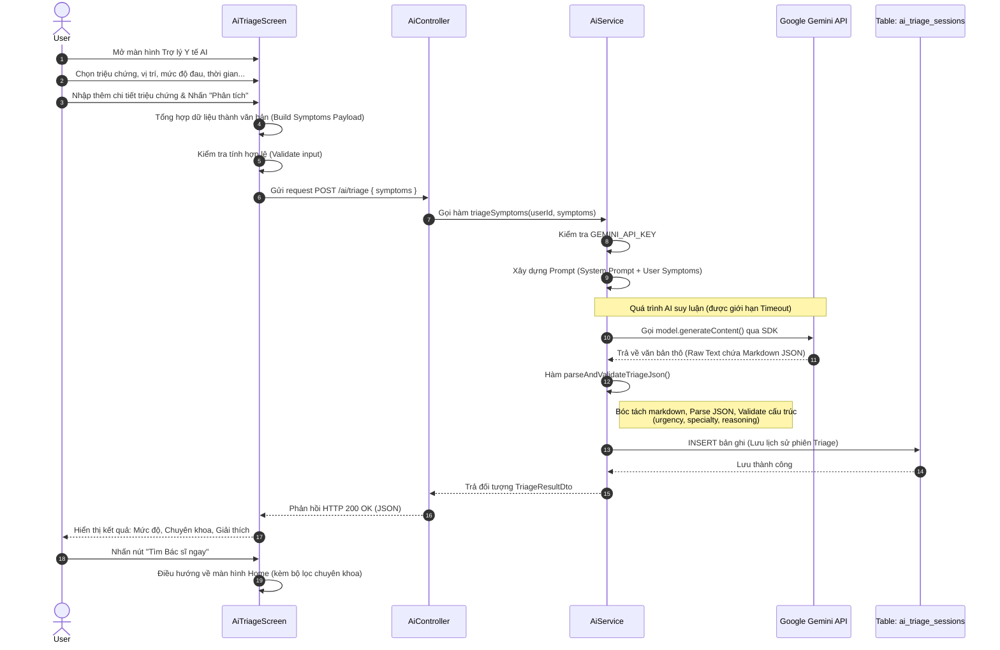

# Sequence Diagram: Chức năng Dự đoán Bệnh (AI Triage)

Dưới đây là Sequence Diagram chi tiết cho chức năng Trợ lý Y tế AI. Sơ đồ mô tả quy trình tổng hợp dữ liệu từ người dùng, gọi API hệ thống, tương tác với dịch vụ AI của Google (Gemini API) để phân tích, xử lý kết quả, lưu lịch sử vào Database và trả về giao diện.

