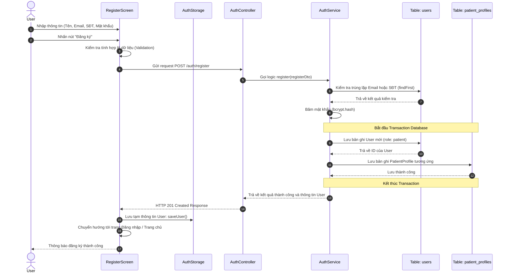

# Sequence Diagram: Chức năng Đăng ký (Register Flow)

Dưới đây là Sequence Diagram mô tả luồng đăng ký thành công. Kịch bản được tinh gọn với các khối vuông tham gia giữ tên tiếng Anh theo sát codebase, và cơ sở dữ liệu được chi tiết hóa thành các bảng `users` và `patient_profiles`. Do nguyên tắc hệ thống là đăng ký mặc định dành cho **Bệnh nhân**, mỗi tài khoản mới sẽ luôn đi kèm một bản ghi `PatientProfile`.

