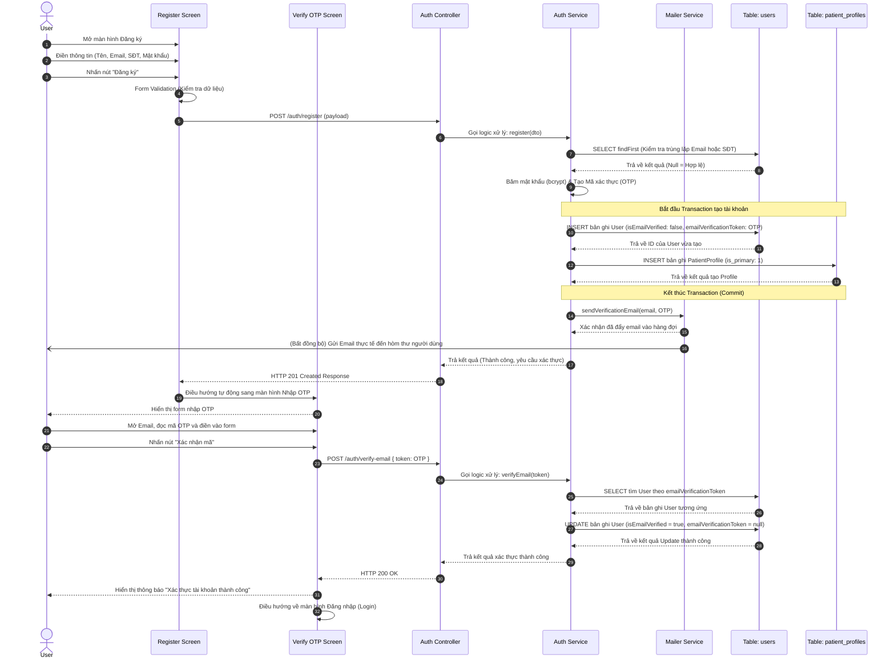

# Sequence Diagram: Chức năng Đăng ký (Có xác thực Email)

Dưới đây là sơ đồ Sequence chi tiết cho chức năng Đăng ký tài khoản có bổ sung **Luồng Xác thực Email (Email Verification)**. Tất cả các bước được vẽ nối tiếp nghiêm ngặt (Synchronous Request - Response) để đảm bảo tính liên tục của luồng thực thi.

