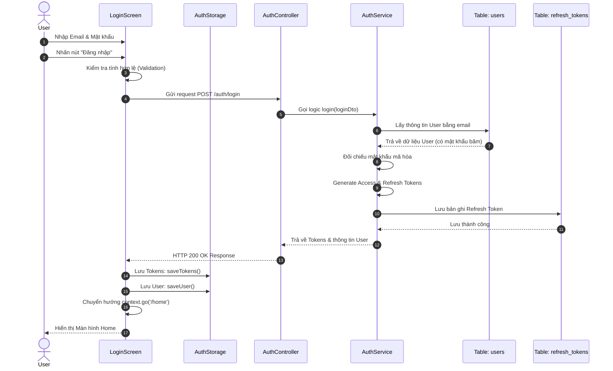

# Sequence Diagram: Chức năng Đăng nhập (Kịch bản chuẩn)

Dưới đây là Sequence Diagram mô tả luồng đăng nhập thành công. Để sơ đồ tinh gọn hơn, toàn bộ logic gửi API ở phía Client (Mobile) đã được gộp chung vào khối `LoginScreen`. Khi đó khối `AuthService` sẽ chỉ còn đại diện duy nhất cho logic xử lý ở phía Backend.

