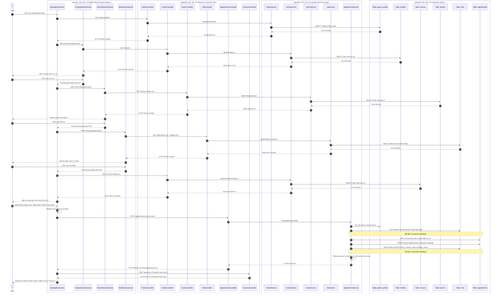

# Sequence Diagram: Chức năng Đặt lịch khám (Tách bạch mọi Controller, Service, Database)

Dưới đây là phiên bản Sequence Diagram phân rã **mọi thành phần** trong hệ thống. Tuyệt đối không gộp chung bất kỳ Endpoint, Controller, Service hay Bảng Database nào. Mỗi luồng dữ liệu đều được vẽ chi tiết xuyên suốt từ: `Mobile UI` -> `Controller` -> `Service` -> `Database Table` và ngược lại.

