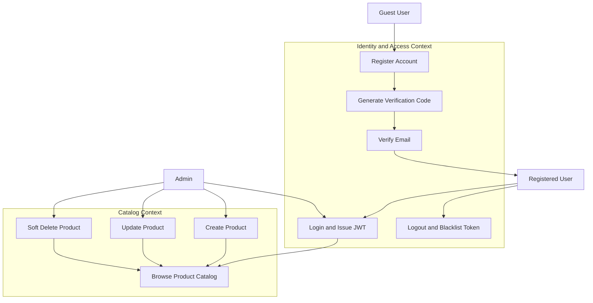
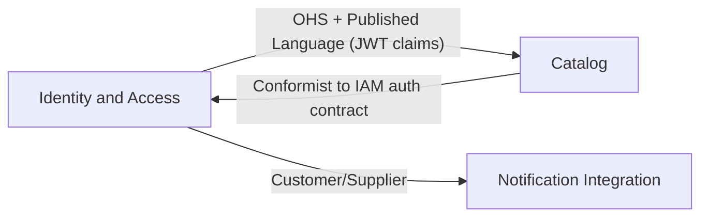
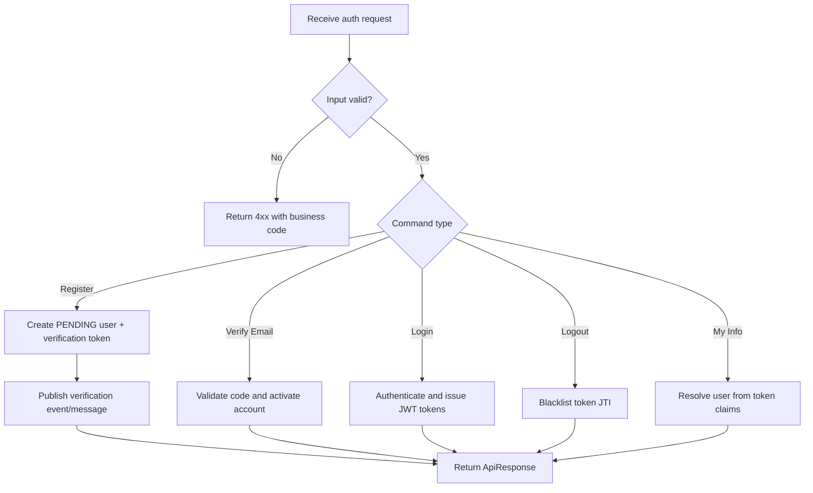
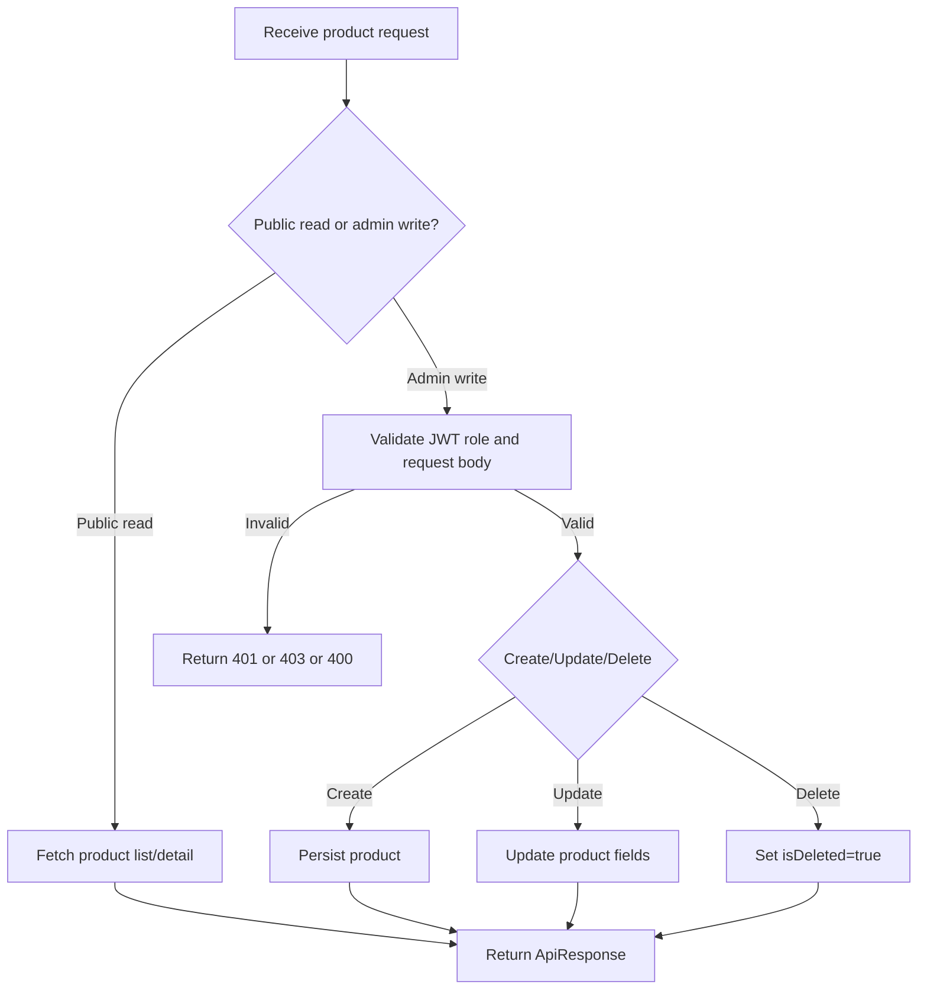

# Analysis and Design — Domain-Driven Design Approach

> **Alternative to**: [`analysis-and-design.md`](analysis-and-design.md) (SOA/Erl approach).
> Choose **one** approach, not both. Use this if your team prefers discovering service boundaries through domain events rather than process decomposition.

**References:**
1. *Domain-Driven Design: Tackling Complexity in the Heart of Software* — Eric Evans
2. *Microservices Patterns: With Examples in Java* — Chris Richardson
3. *Bài tập — Phát triển phần mềm hướng dịch vụ* — Hung Dang (available in Vietnamese)

---

## Part 1 — Domain Discovery

### 1.1 Business Process Definition

Describe or diagram the high-level Business Process to be automated.

- **Domain**: E-commerce
- **Business Process**: Account onboarding and product catalog management
- **Actors**: Guest user, registered user, admin, identity service, product service, notification channel (email)
- **Scope**: User registration, email verification, login/logout, profile retrieval, and product catalog CRUD (admin write, public read)

**Process Diagram:**

### 1.2 Existing Automation Systems

| System Name | Type | Current Role | Interaction Method |
|-------------|------|--------------|-------------------|
| Legacy spreadsheet + manual email | Manual process | Store account requests and product list | Human operation only |
| Existing social login provider (optional future) | External SaaS | Potential upstream identity source | OAuth2/OIDC (planned) |

Current assignment baseline assumes no trusted legacy automation in production flow.

### 1.3 Non-Functional Requirements

| Requirement    | Description |
|----------------|-------------|
| Performance    | P95 read API latency under 300 ms for product listing at normal load |
| Security       | JWT bearer auth, token invalidation on logout, protected admin endpoints |
| Scalability    | Product read traffic scales horizontally; identity and catalog services independently deployable |
| Availability   | Core APIs target 99.9% service availability with graceful degradation for non-critical email verification delays |

---

## Part 2 — Strategic Domain-Driven Design

### 2.1 Event Storming — Domain Events

List Domain Events in chronological order as they occur in the business process.
Format: past tense (e.g., "OrderPlaced", "PaymentReceived").

| # | Domain Event | Triggered By | Description |
|---|-------------|--------------|-------------|
| 1 | UserRegistrationRequested | RegisterAccount | A guest submits username, password, and email |
| 2 | UserRegistered | RegisterAccount | New user aggregate is created in PENDING state |
| 3 | VerificationCodeGenerated | RegisterAccount | Verification token/code is generated |
| 4 | VerificationEmailRequested | PublishVerificationMessage | Notification message is sent to email channel |
| 5 | EmailVerified | VerifyEmail | User provides valid verification code |
| 6 | UserActivated | VerifyEmail | Account state changes from PENDING to ACTIVE |
| 7 | UserLoginRequested | Login | Credentials are submitted for authentication |
| 8 | UserAuthenticated | Login | Access and refresh tokens are issued |
| 9 | UserLoggedOut | Logout | Current token is invalidated/blacklisted |
| 10 | ProductCreated | CreateProduct | Admin creates a new catalog item |
| 11 | ProductUpdated | UpdateProduct | Admin modifies product details |
| 12 | ProductSoftDeleted | DeleteProduct | Admin marks product as deleted |
| 13 | ProductQueried | QueryProducts/QueryProductDetail | Public user requests product list/detail |

### 2.2 Commands and Actors

What Commands trigger those Domain Events, and who issues them?

| Command | Actor | Triggers Event(s) |
|---------|-------|--------------------|
| RegisterAccount | Guest user | UserRegistrationRequested, UserRegistered, VerificationCodeGenerated |
| PublishVerificationMessage | Identity Service | VerificationEmailRequested |
| VerifyEmail | Guest user | EmailVerified, UserActivated |
| Login | User | UserLoginRequested, UserAuthenticated |
| Logout | User | UserLoggedOut |
| GetMyInfo | User | User profile read (query-side state access) |
| CreateProduct | Admin | ProductCreated |
| UpdateProduct | Admin | ProductUpdated |
| DeleteProduct | Admin | ProductSoftDeleted |
| QueryProducts | Guest user/User | ProductQueried |
| QueryProductDetail | Guest user/User | ProductQueried |

### 2.3 Aggregates

Group related Commands and Events around the business entities (Aggregates) they operate on.

| Aggregate | Commands | Domain Events | Owned Data |
|-----------|----------|---------------|------------|
| UserAccount | RegisterAccount, VerifyEmail, Login, GetMyInfo | UserRegistered, UserActivated, UserAuthenticated | userId, username, email, passwordHash, status, roles |
| VerificationToken | RegisterAccount, VerifyEmail | VerificationCodeGenerated, EmailVerified | tokenId, email, code, expiration, usedFlag |
| SessionToken | Login, Logout | UserAuthenticated, UserLoggedOut | jti, subjectUserId, issueTime, expiryTime, blacklistStatus |
| Product | CreateProduct, UpdateProduct, DeleteProduct | ProductCreated, ProductUpdated, ProductSoftDeleted | productId, name, description, price, stock, categoryId, images, isDeleted |
| Category | CreateProduct, UpdateProduct, QueryProducts | CategoryReferenced | categoryId, categoryName |

### 2.4 Bounded Contexts

Draw boundaries around Aggregates that belong to the same business context. Each Bounded Context = one potential service.

| Bounded Context | Aggregates | Responsibility |
|-----------------|------------|----------------|
| Identity and Access Context | UserAccount, VerificationToken, SessionToken | User lifecycle, authentication, authorization boundary |
| Catalog Context | Product, Category | Product information management and public/admin catalog operations |
| Notification Integration Context | (No core business aggregate, integration model only) | Outbound event/message translation for email delivery |

### 2.5 Context Map

Show relationships between Bounded Contexts.

**Relationship types:** Upstream/Downstream, Customer/Supplier, Conformist, Anti-Corruption Layer (ACL), Shared Kernel, Open Host Service (OHS), Published Language.

| Upstream | Downstream | Relationship Type |
|----------|------------|-------------------|
| Identity and Access | Catalog | Open Host Service + Published Language |
| Identity and Access | Notification Integration | Customer/Supplier |
| Identity and Access | API Gateway (edge layer) | Upstream identity provider for token validation |

---

## Part 3 — Service-Oriented Design

### 3.1 Uniform Contract Design

Service Contract specification for each Bounded Context / service.
Full OpenAPI specs:
- [`docs/api-specs/identity-service.yaml`](api-specs/identity-service.yaml)
- [`docs/api-specs/product-service.yaml`](api-specs/product-service.yaml)

**Identity Service:**

| Endpoint | Method | Media Type | Response Codes |
|----------|--------|------------|----------------|
| /api/v1/auth/register | POST | application/json | 201, 409 |
| /api/v1/auth/verify-email | POST | application/json | 200, 401 |
| /api/v1/auth/login | POST | application/json | 200, 401, 403 |
| /api/v1/auth/logout | POST | application/json | 200, 401 |
| /api/v1/users/my-info | GET | application/json | 200, 401 |

**Product Service:**

| Endpoint | Method | Media Type | Response Codes |
|----------|--------|------------|----------------|
| /api/v1/products | GET | application/json | 200 |
| /api/v1/products | POST | application/json | 201, 401, 403 |
| /api/v1/products/{productId} | GET | application/json | 200, 404 |
| /api/v1/products/{productId} | PUT | application/json | 200, 401, 403, 404 |
| /api/v1/products/{productId} | DELETE | application/json | 200, 401, 403, 404 |

### 3.2 Service Logic Design

Internal processing flow for each service.

**Identity Service:**

**Product Service:**

