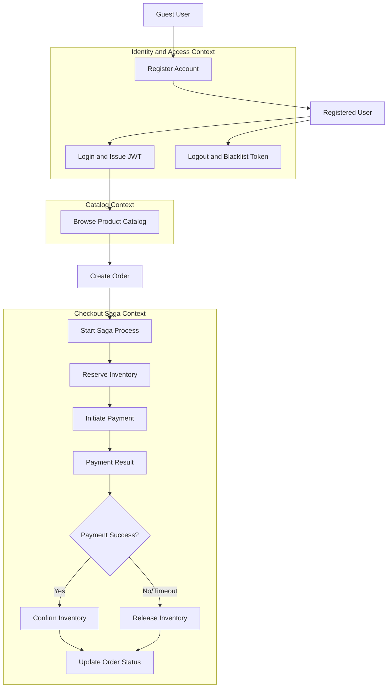
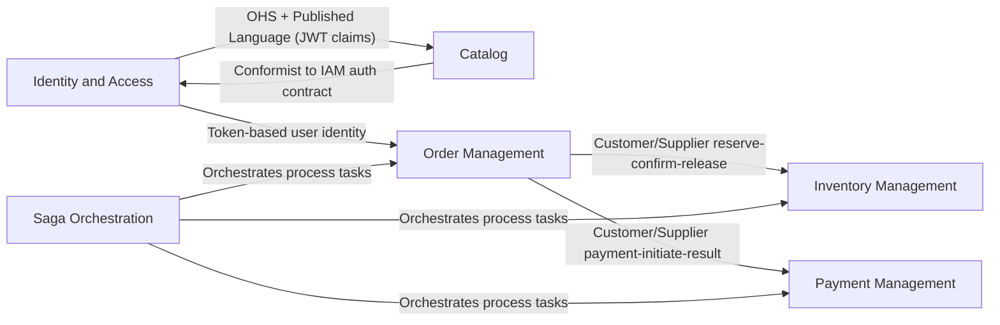
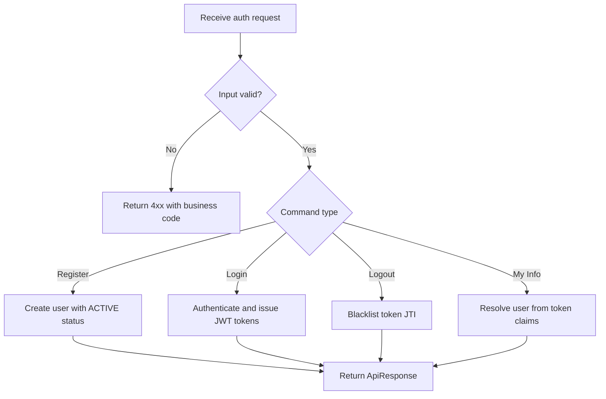
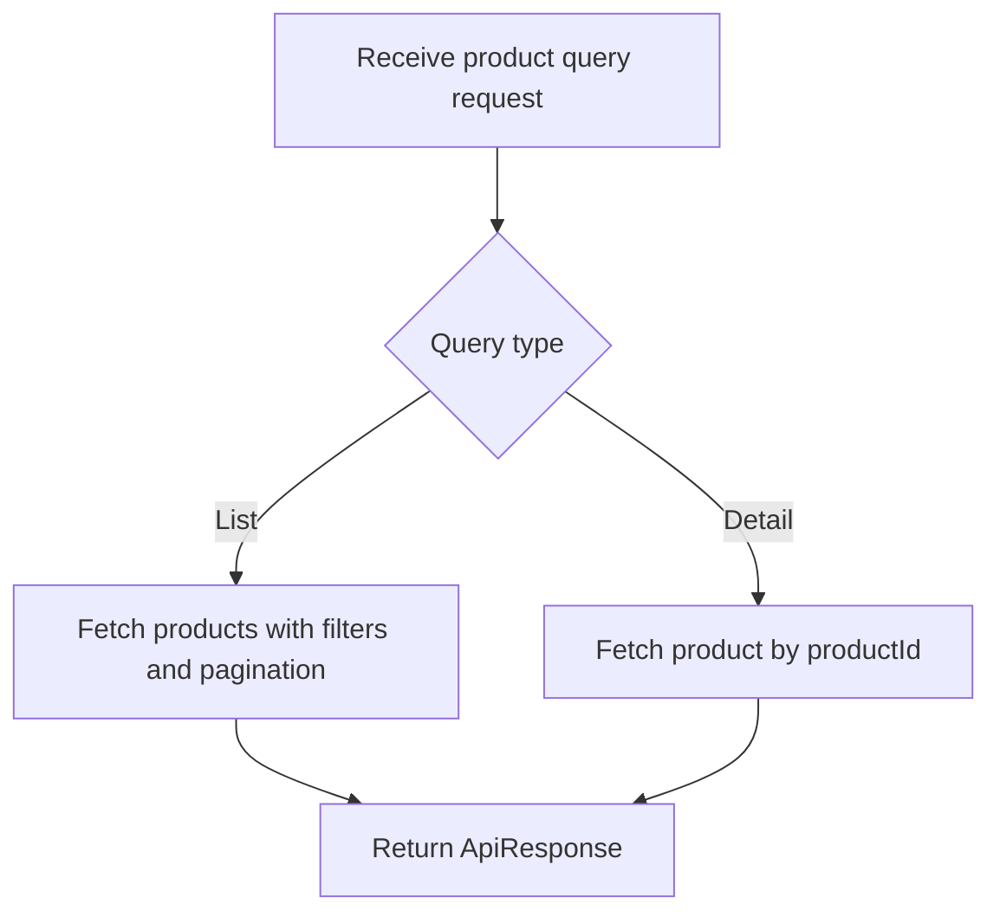
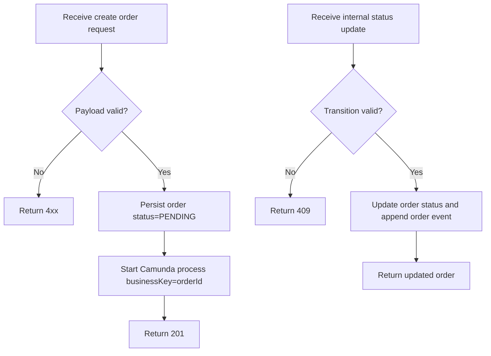
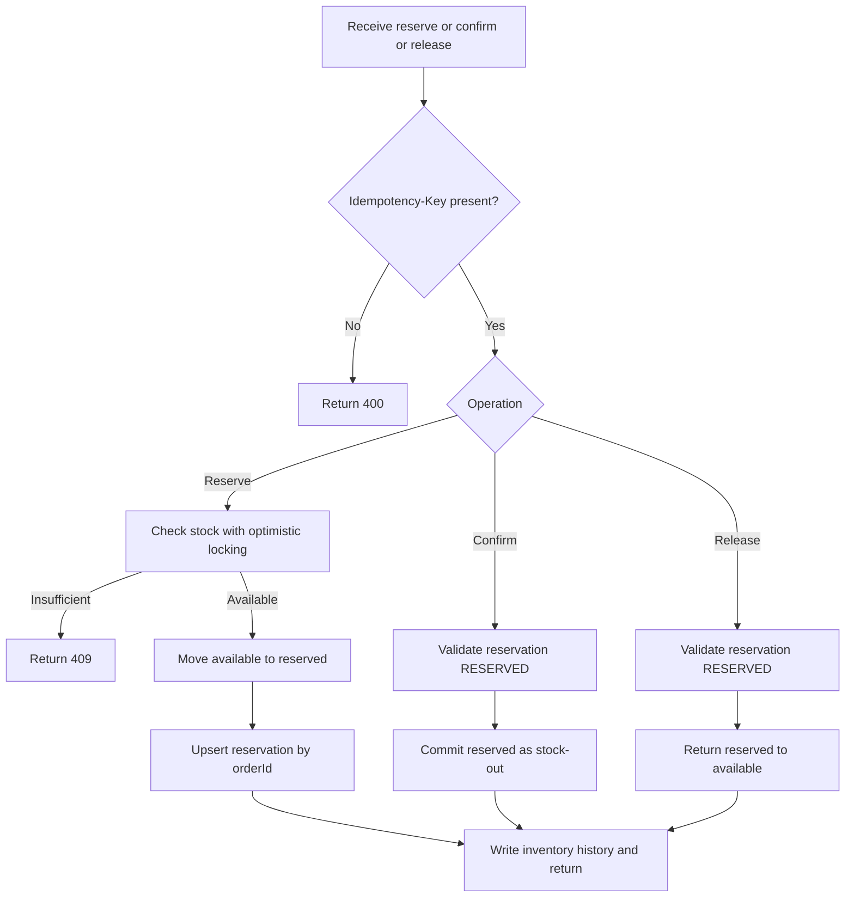
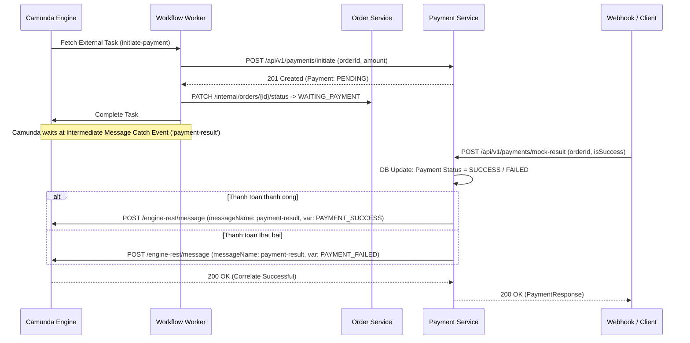

# Analysis and Design — Domain-Driven Design Approach

> **Alternative to**: [`analysis-and-design.md`](analysis-and-design.md) (SOA/Erl approach).
> Choose **one** approach, not both. Use this if your team prefers discovering service boundaries through domain events rather than process decomposition.

**References:**
1. *Domain-Driven Design: Tackling Complexity in the Heart of Software* — Eric Evans
2. *Microservices Patterns: With Examples in Java* — Chris Richardson
3. *Bài tập — Phát triển phần mềm hướng dịch vụ* — Hung Dang (available in Vietnamese)

---

## Part 1 — Domain Discovery

### 1.1 Business Process Definition

Describe or diagram the high-level Business Process to be automated.

- **Domain**: E-commerce
- **Business Process**: Account onboarding, product catalog management, and checkout order orchestration
- **Actors**: Guest user, registered user, identity service, product service, order service, inventory service, payment service, workflow worker, Camunda engine
- **Scope**: User registration, login/logout, profile retrieval, product catalog read (public), order creation, inventory reserve/confirm/release, payment initiation and result correlation, and payment-result driven status transitions

**Process Diagram:**

### 1.2 Existing Automation Systems

| System Name | Type | Current Role | Interaction Method |
|-------------|------|--------------|-------------------|
| Legacy spreadsheet + manual email | Manual process | Store account requests and product list | Human operation only |
| Existing social login provider (optional future) | External SaaS | Potential upstream identity source | OAuth2/OIDC (planned) |
| Payment gateway sandbox (mock) | External SaaS | Sends payment success/failure result for checkout flow | REST callback / message correlation |
| External payment gateway (future) | External SaaS | Real payment provider for initiated transactions | Webhook / REST callback |

Current assignment baseline assumes no trusted legacy automation in production flow.

### 1.3 Non-Functional Requirements

| Requirement    | Description |
|----------------|-------------|
| Performance    | P95 read API latency under 300 ms for product listing at normal load |
| Security       | JWT bearer auth, token invalidation on logout, and service-to-service protection for internal endpoints |
| Scalability    | Product read traffic scales horizontally; identity and catalog services independently deployable |
| Availability   | Core APIs target 99.9% service availability with independent deployment and horizontal scaling |
| Data Consistency | Checkout across order + inventory uses Saga orchestration with compensation (no distributed transaction) |
| Idempotency | Reserve/confirm/release inventory operations must be idempotent via orderId key |
| Async Payment Handling | Payment confirmation is asynchronous and must resume the saga through message correlation |

---

## Part 2 — Strategic Domain-Driven Design

### 2.1 Event Storming — Domain Events

List Domain Events in chronological order as they occur in the business process.
Format: past tense (e.g., "OrderPlaced", "PaymentReceived").

| # | Domain Event | Triggered By | Description |
|---|-------------|--------------|-------------|
| 1 | UserRegistrationRequested | RegisterAccount | A guest submits username, password, and email |
| 2 | UserRegistered | RegisterAccount | New user aggregate is created in ACTIVE state |
| 3 | UserLoginRequested | Login | Credentials are submitted for authentication |
| 4 | UserAuthenticated | Login | Access and refresh tokens are issued |
| 5 | UserLoggedOut | Logout | Current token is invalidated/blacklisted |
| 6 | ProductQueried | QueryProducts/QueryProductDetail | Public user requests product list/detail |
| 7 | OrderCreated | CreateOrder | Customer submits order with item list |
| 8 | CheckoutSagaStarted | StartCheckoutSaga | Process instance starts for distributed checkout workflow |
| 9 | InventoryReserved | ReserveInventory | Requested quantities are moved to reserved stock |
| 10 | InventoryReservationFailed | ReserveInventory | Reservation fails due to stock or conflict |
| 11 | PaymentResultReceived | CorrelatePaymentResult | Payment success/failure signal is correlated to process |
| 12 | InventoryConfirmed | ConfirmInventory | Reserved stock is confirmed as final stock-out |
| 13 | InventoryReleased | ReleaseInventory | Reserved stock is returned to available stock |
| 14 | OrderConfirmed | UpdateOrderStatus | Order transitions to confirmed |
| 15 | OrderPaymentFailed | UpdateOrderStatus | Order transitions to payment_failed after compensation |
| 16 | PaymentInitiated | InitiatePayment | Payment record is created in PENDING state |
| 17 | PaymentSucceeded | MockResultCallback | Payment service receives successful payment callback |
| 18 | PaymentFailed | MockResultCallback | Payment service receives failed payment callback |
| 19 | PaymentCorrelated | CorrelatePaymentResult | Camunda receives message to continue saga |

### 2.2 Commands and Actors

What Commands trigger those Domain Events, and who issues them?

| Command | Actor | Triggers Event(s) |
|---------|-------|--------------------|
| RegisterAccount | Guest user | UserRegistrationRequested, UserRegistered |
| Login | User | UserLoginRequested, UserAuthenticated |
| Logout | User | UserLoggedOut |
| GetMyInfo | User | User profile read (query-side state access) |
| QueryProducts | Guest user/User | ProductQueried |
| QueryProductDetail | Guest user/User | ProductQueried |
| CreateOrder | User | OrderCreated |
| StartCheckoutSaga | Order Service | CheckoutSagaStarted |
| ReserveInventory | Workflow Worker | InventoryReserved or InventoryReservationFailed |
| CorrelatePaymentResult | Payment Adapter / Client | PaymentResultReceived |
| InitiatePayment | Workflow Worker | PaymentInitiated |
| MockPaymentResult | Webhook / Client | PaymentSucceeded or PaymentFailed |
| CorrelatePaymentResult | Payment Service | PaymentCorrelated |
| ConfirmInventory | Workflow Worker | InventoryConfirmed |
| ReleaseInventory | Workflow Worker | InventoryReleased |
| UpdateOrderStatus | Workflow Worker | OrderConfirmed, OrderPaymentFailed |

### 2.3 Aggregates

Group related Commands and Events around the business entities (Aggregates) they operate on.

| Aggregate | Commands | Domain Events | Owned Data |
|-----------|----------|---------------|------------|
| UserAccount | RegisterAccount, Login, GetMyInfo | UserRegistered, UserAuthenticated | userId, username, email, passwordHash, status, roles |
| SessionToken | Login, Logout | UserAuthenticated, UserLoggedOut | jti, subjectUserId, issueTime, expiryTime, blacklistStatus |
| Product | QueryProducts, QueryProductDetail | ProductQueried | productId, name, description, price, stock, categoryId, images, isDeleted |
| Category | QueryProducts | CategoryReferenced | categoryId, categoryName |
| Order | CreateOrder, UpdateOrderStatus, CancelOrder | OrderCreated, OrderConfirmed, OrderPaymentFailed | orderId, userId, status, totalAmount, createdAt, updatedAt |
| OrderItem | CreateOrder | OrderCreated | orderId, productId, quantity, price |
| OrderEvent | UpdateOrderStatus | OrderConfirmed, OrderPaymentFailed | eventId, orderId, eventType, description, createdAt |
| InventoryItem | ReserveInventory, ConfirmInventory, ReleaseInventory | InventoryReserved, InventoryConfirmed, InventoryReleased | productId, availableStock, reservedStock, version |
| InventoryReservation | ReserveInventory, ConfirmInventory, ReleaseInventory | InventoryReserved, InventoryReservationFailed, InventoryConfirmed, InventoryReleased | reservationId, orderId, status, reservedAt, confirmedAt, releasedAt |
| InventoryHistory | ReserveInventory, ConfirmInventory, ReleaseInventory | InventoryReserved, InventoryConfirmed, InventoryReleased | historyId, productId, eventType, delta, source, idempotencyKey |
| Payment | InitiatePayment, MockPaymentResult | PaymentInitiated, PaymentSucceeded, PaymentFailed | paymentId, orderId, amount, status, paymentMethod, transactionId |

### 2.4 Bounded Contexts

Draw boundaries around Aggregates that belong to the same business context. Each Bounded Context = one potential service.

| Bounded Context | Aggregates | Responsibility |
|-----------------|------------|----------------|
| Identity and Access Context | UserAccount, SessionToken | User lifecycle, authentication, authorization boundary |
| Catalog Context | Product, Category | Product information management and public catalog queries |
| Order Management Context | Order, OrderItem, OrderEvent | Checkout order lifecycle, status transitions, and order timeline |
| Inventory Management Context | InventoryItem, InventoryReservation, InventoryHistory | Stock reservation and compensation-safe inventory mutations |
| Payment Management Context | Payment | Payment record ownership, payment status tracking, and gateway/webhook bridge |
| Saga Orchestration Context | Process state in Camunda | Coordinates checkout steps and compensation path |

### 2.5 Context Map

Show relationships between Bounded Contexts.

**Relationship types:** Upstream/Downstream, Customer/Supplier, Conformist, Anti-Corruption Layer (ACL), Shared Kernel, Open Host Service (OHS), Published Language.

| Upstream | Downstream | Relationship Type |
|----------|------------|-------------------|
| Identity and Access | Catalog | Open Host Service + Published Language |
| Identity and Access | API Gateway (edge layer) | Upstream identity provider for token validation |
| Identity and Access | Order Management | Open Host Service + Published Language |
| Order Management | Inventory Management | Customer/Supplier |
| Saga Orchestration | Order Management | Upstream/Downstream orchestration contract |
| Saga Orchestration | Inventory Management | Upstream/Downstream orchestration contract |
| Order Management | Payment Management | Customer/Supplier |
| Saga Orchestration | Payment Management | Upstream/Downstream orchestration contract |

---

## Part 3 — Service-Oriented Design

### 3.1 Uniform Contract Design

Service Contract specification for each Bounded Context / service.
Full OpenAPI specs:
- [`docs/api-specs/identity-service.yaml`](api-specs/identity-service.yaml)
- [`docs/api-specs/product-service.yaml`](api-specs/product-service.yaml)
- `docs/api-specs/order-service.yaml` (supplementary design target)
- `docs/api-specs/inventory-service.yaml` (supplementary design target)
- `docs/api-specs/payment-service.yaml` (supplementary design target)

**Identity Service:**

| Endpoint | Method | Media Type | Response Codes |
|----------|--------|------------|----------------|
| /api/v1/auth/register | POST | application/json | 201, 409 |
| /api/v1/auth/login | POST | application/json | 200, 401, 403 |
| /api/v1/auth/logout | POST | application/json | 200, 401 |
| /api/v1/users/my-info | GET | application/json | 200, 401 |

**Product Service:**

| Endpoint | Method | Media Type | Response Codes |
|----------|--------|------------|----------------|
| /api/v1/products | GET | application/json | 200 |
| /api/v1/products/{productId} | GET | application/json | 200, 404 |

Current assignment implementation scope excludes admin write endpoints (`POST/PUT/DELETE` for product management).

**Order Service (Supplementary):**

| Endpoint | Method | Media Type | Response Codes |
|----------|--------|------------|----------------|
| /api/v1/orders | POST | application/json | 201, 400 |
| /api/v1/orders/{orderId} | GET | application/json | 200, 404 |
| /api/v1/orders/user/{userId} | GET | application/json | 200 |
| /api/v1/orders/{orderId}/timeline | GET | application/json | 200, 404 |
| /api/v1/orders/{orderId}/cancel | PUT | application/json | 200, 404, 409 |
| /internal/orders/{orderId}/status | PATCH | application/json | 200, 404 |

**Inventory Service (Supplementary):**

| Endpoint | Method | Media Type | Response Codes |
|----------|--------|------------|----------------|
| /api/v1/inventory/{productId} | GET | application/json | 200, 404 |
| /api/v1/inventory/{productId} | PUT | application/json | 200, 400 |
| /api/v1/inventory | GET | application/json | 200 |
| /api/v1/inventory/stock-in | POST | application/json | 200, 400 |
| /api/v1/inventory/low-stock | GET | application/json | 200 |
| /api/v1/inventory/history/{productId} | GET | application/json | 200 |
| /api/v1/inventory/reserve | POST | application/json | 200, 409 |
| /api/v1/inventory/confirm | POST | application/json | 200, 404, 409 |
| /api/v1/inventory/release | POST | application/json | 200, 404, 409 |
| /api/v1/inventory/reserved/{orderId} | GET | application/json | 200, 404 |

Note: Privileged inventory administration operations are treated as supplementary design; current assignment focuses on checkout saga paths.

**Payment Service (Supplementary):**

| Endpoint | Method | Media Type | Response Codes |
|----------|--------|------------|----------------|
| /api/v1/payments/initiate | POST | application/json | 201, 400, 404, 409 |
| /api/v1/payments/{paymentId} | GET | application/json | 200, 404 |
| /api/v1/payments/order/{orderId} | GET | application/json | 200, 404 |
| /api/v1/payments/mock-result | POST | application/json | 200, 400 |

### 3.2 Service Logic Design

Internal processing flow for each service.

**Identity Service:**

**Product Service:**

**Order Service (Supplementary):**

**Inventory Service (Supplementary):**

**Payment Service (Supplementary):**

