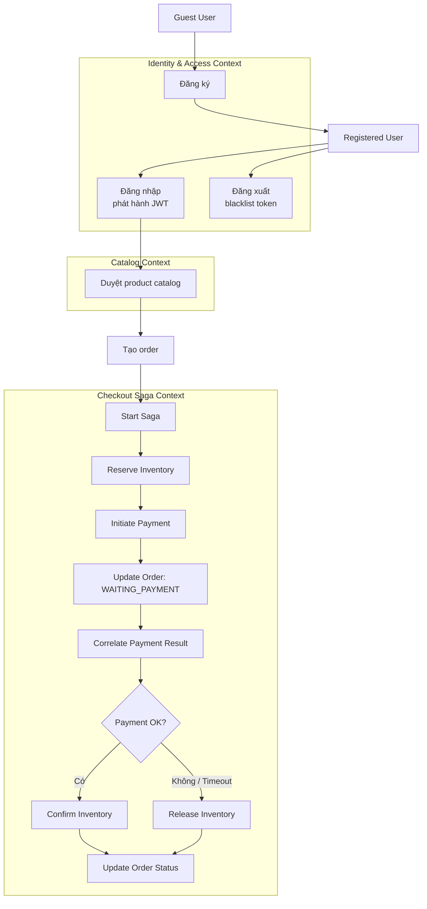
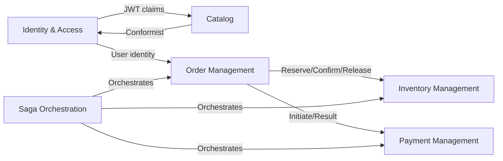
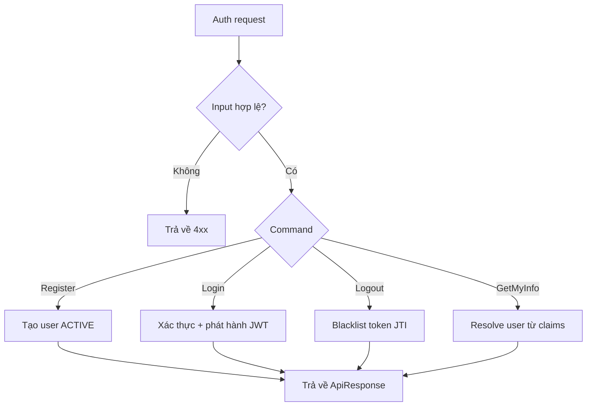
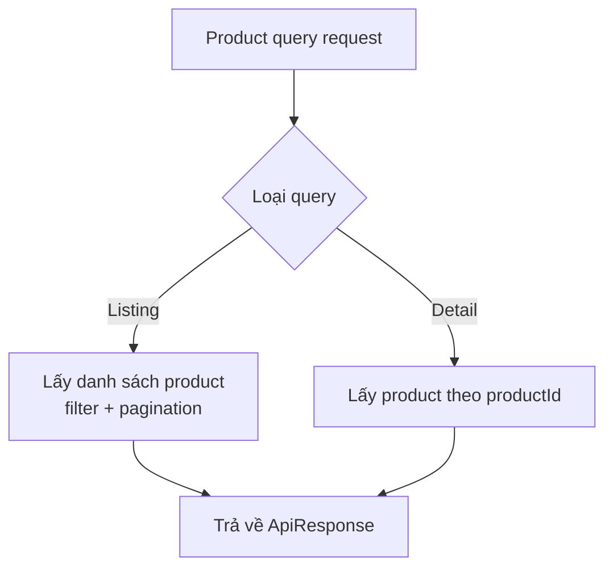
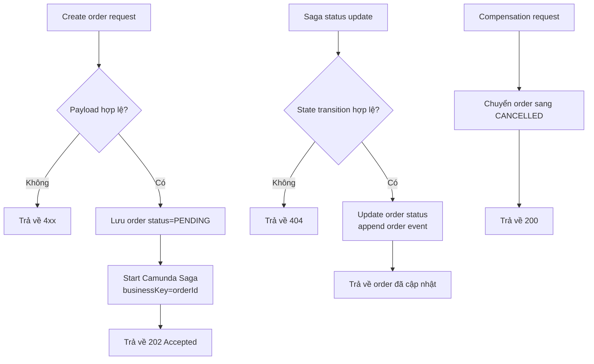
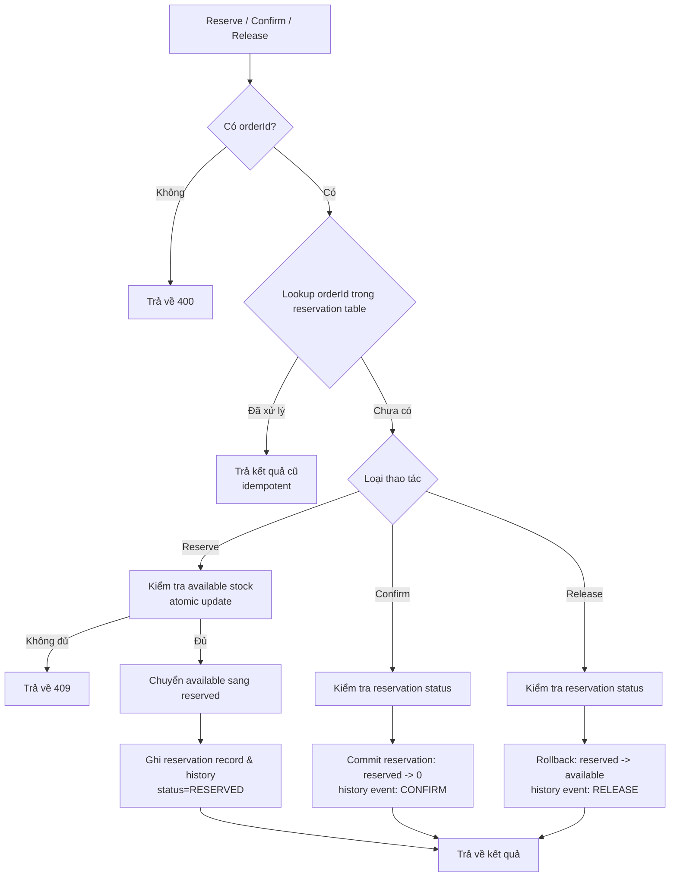
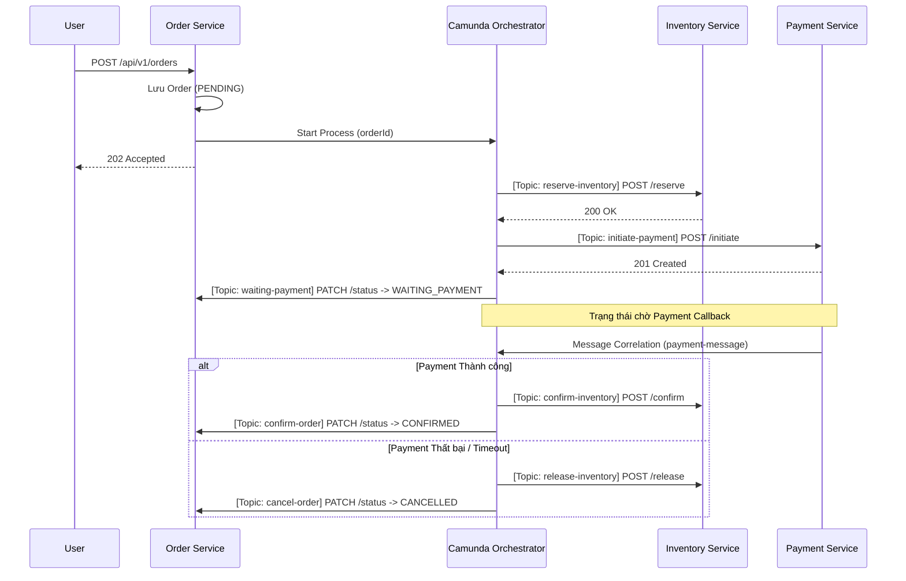

# Phân tích và Thiết kế — Domain-Driven Design (DDD)

> **Thay thế cho**: [`analysis-and-design.md`](analysis-and-design.md) (phương pháp SOA/Erl).
> Chọn **một** trong hai phương pháp. Dùng phương pháp này nếu team muốn khám phá ranh giới service thông qua domain event thay vì phân tích process.

**Tài liệu tham khảo:**
1. *Domain-Driven Design: Tackling Complexity in the Heart of Software* — Eric Evans
2. *Microservices Patterns: With Examples in Java* — Chris Richardson
3. *Bài tập — Phát triển phần mềm hướng dịch vụ* — Hung Dang (có bản tiếng Việt)

---

## Phần 1 — Khám phá Domain

### 1.1 Business Process

Mô tả hoặc sơ đồ hóa business process cấp cao cần được tự động hóa.

- **Domain**: Thương mại điện tử
- **Business Process**: Đăng ký và xác thực tài khoản người dùng, 
  truy vấn product catalog công khai và order-payment orchestration
- **Các actor**: Guest user, registered user, authentication service, product service, order service, inventory service, payment service, workflow worker, Camunda engine
- **Phạm vi**: Đăng ký người dùng; đăng nhập/đăng xuất; xem thông tin profile; truy vấn danh sách và chi tiết sản phẩm (read-only); tạo order; reserve/confirm/release inventory; khởi tạo payment và correlate kết quả; chuyển trạng thái order dựa trên kết quả payment

**Process Diagram:**

### 1.2 Các hệ thống hiện tại

| Tên hệ thống | Loại | Vai trò hiện tại | Phương thức tương tác |
|---|---|---|---|
| Không có | N/A | Quy trình hiện tại hoàn toàn chưa được tự động hóa. | N/A |

### 1.3 Non-Functional Requirements

| Requirement | Mô tả |
|---|---|
| Performance | P95 read latency dưới 300 ms cho product listing ở tải bình thường |
| Security | JWT bearer authentication, token invalidation khi logout, và service-to-service protection cho internal endpoint |
| Scalability | Product read traffic scale ngang; authentication service và catalog service deploy độc lập |
| Availability | Core API nhắm đến 99.9% uptime với independent deployment và horizontal scaling |
| Data Consistency | Checkout flow dùng Saga orchestration với compensating transaction — không dùng distributed transaction |
| Idempotency | Các thao tác reserve/confirm/release inventory phải idempotent thông qua `orderId` key |
| Async Payment | Payment confirmation là bất đồng bộ — saga tiếp tục thông qua message correlation |

---

## Phần 2 — Strategic Domain-Driven Design

### 2.1 Event Storming — Domain Events

Liệt kê các Domain Event theo thứ tự thời gian xảy ra trong business process.
Quy tắc đặt tên: dùng thì quá khứ (ví dụ: `OrderPlaced`, `PaymentReceived`).

| # | Domain Event | Được trigger bởi | Mô tả |
|---|---|---|---|
| 1 | UserRegistrationRequested | RegisterAccount | Guest gửi username, password và email |
| 2 | UserRegistered | RegisterAccount | User aggregate mới được tạo với trạng thái ACTIVE |
| 3 | UserLoginRequested | Login | Credential được gửi để xác thực |
| 4 | UserAuthenticated | Login | Access token và refresh token được phát hành |
| 5 | UserLoggedOut | Logout | Token hiện tại bị invalidate/blacklist |
| 6 | ProductQueried | QueryProducts / QueryProductDetail | User yêu cầu danh sách hoặc chi tiết sản phẩm |
| 7 | OrderCreated | CreateOrder | Customer gửi order với danh sách item |
| 8 | CheckoutSagaStarted | StartCheckoutSaga | Process instance được khởi tạo cho distributed checkout workflow |
| 9 | InventoryReserved | ReserveInventory | Số lượng yêu cầu được chuyển sang reserved inventory |
| 10 | InventoryReservationFailed | ReserveInventory | Reserve thất bại do không đủ hàng hoặc conflict |
| 11 | PaymentResultReceived | CorrelatePaymentResult | Tín hiệu success/failure được correlate với process instance |
| 12 | InventoryConfirmed | ConfirmInventory | Reserved inventory được confirm là xuất hàng chính thức |
| 13 | InventoryReleased | ReleaseInventory | Reserved inventory được hoàn trả về available inventory |
| 14 | OrderConfirmed | UpdateOrderStatus | Order chuyển sang trạng thái `CONFIRMED` |
| 15 | OrderCancelled | UpdateOrderStatus | Order chuyển sang `CANCELLED` sau compensating transaction |
| 16 | PaymentInitiated | InitiatePayment | Payment record được tạo với trạng thái PENDING |
| 17 | PaymentSucceeded | MockPaymentResult | Payment service nhận callback thành công |
| 18 | PaymentFailed | MockPaymentResult | Payment service nhận callback thất bại |
| 19 | OrderWaitingPayment | UpdateOrderStatus | Order chuyển sang `WAITING_PAYMENT` |
| 20 | OrderPaymentFailed | UpdateOrderStatus | Order chuyển sang `PAYMENT_FAILED` (trung gian) |

### 2.2 Commands và Actors

Command nào trigger các domain event đó, và ai là người phát ra chúng?

| Command | Actor | Domain Event(s) được trigger |
|---|---|---|
| RegisterAccount | Guest user | UserRegistrationRequested, UserRegistered |
| Login | User | UserLoginRequested, UserAuthenticated |
| Logout | User | UserLoggedOut |
| GetMyInfo | User | _(đọc trực tiếp từ read-side, không tạo event)_ |
| QueryProducts | Guest / Registered user | ProductQueried |
| QueryProductDetail | Guest / Registered user | ProductQueried |
| CreateOrder | Registered user | OrderCreated |
| StartCheckoutSaga | Order service | CheckoutSagaStarted |
| ReserveInventory | Workflow worker | InventoryReserved hoặc InventoryReservationFailed |
| CorrelatePaymentResult | Payment adapter / client, Payment service | PaymentResultReceived, PaymentCorrelated |
| InitiatePayment | Workflow worker | PaymentInitiated |
| MockPaymentResult | Webhook / client | PaymentSucceeded hoặc PaymentFailed |
| ConfirmInventory | Workflow worker | InventoryConfirmed |
| ReleaseInventory | Workflow worker | InventoryReleased |
| UpdateOrderStatus | Workflow worker | OrderConfirmed, OrderPaymentFailed |

### 2.3 Aggregates

Nhóm các command và event liên quan quanh các business entity (aggregate) mà chúng tác động lên.

| Aggregate | Commands | Domain Events | Owned Data |
|---|---|---|---|
| UserAccount | RegisterAccount, Login, GetMyInfo | UserRegistered, UserAuthenticated | userId, username, email, passwordHash, status, roles |
| SessionToken | Login, Logout | UserAuthenticated, UserLoggedOut | jti, subjectUserId, issueTime, expiryTime, blacklistStatus |
| Product | QueryProducts, QueryProductDetail | ProductQueried | productId, name, description, price, stock, categoryId, images, isDeleted |
| Category | QueryProducts | CategoryReferenced | categoryId, categoryName |
| Order | CreateOrder, UpdateOrderStatus | OrderCreated, OrderConfirmed, OrderPaymentFailed | orderId, userId, status, totalAmount, createdAt, updatedAt |
| OrderItem | CreateOrder | OrderCreated | orderId, productId, quantity, price |
| OrderEvent | UpdateOrderStatus | OrderConfirmed, OrderPaymentFailed | eventId, orderId, eventType, description, createdAt |
| InventoryItem | ReserveInventory, ConfirmInventory, ReleaseInventory | InventoryReserved, InventoryConfirmed, InventoryReleased | productId, availableStock, reservedStock, version |
| InventoryReservation | ReserveInventory, ConfirmInventory, ReleaseInventory | InventoryReserved, InventoryReservationFailed, InventoryConfirmed, InventoryReleased | reservationId, orderId, status, reservedAt, confirmedAt, releasedAt |
| InventoryHistory | ReserveInventory, ConfirmInventory, ReleaseInventory | InventoryReserved, InventoryConfirmed, InventoryReleased | historyId, productId, eventType, delta, source, idempotencyKey |
| Payment | InitiatePayment, MockPaymentResult | PaymentInitiated, PaymentSucceeded, PaymentFailed | paymentId, orderId, amount, status, paymentMethod, transactionId |

### 2.4 Bounded Contexts

Gom các aggregate thuộc cùng một business context lại với nhau. Mỗi Bounded Context là một service tiềm năng.

| Bounded Context | Aggregates | Trách nhiệm |
|---|---|---|
| Identity & Access Context | UserAccount, SessionToken | Vòng đời người dùng, authentication, và authorization boundary |
| Catalog Context | Product, Category | Quản lý thông tin sản phẩm và truy vấn catalog công khai |
| Order Management Context | Order, OrderItem, OrderEvent | Vòng đời order, state transition, và order timeline |
| Inventory Management Context | InventoryItem, InventoryReservation, InventoryHistory | Reserve inventory và compensating inventory change an toàn |
| Payment Management Context | Payment | Quản lý payment record, theo dõi trạng thái, và tích hợp gateway/webhook |
| Saga Orchestration Context | Process state trong Camunda | Điều phối các bước checkout và compensating path |

### 2.5 Context Map

Thể hiện mối quan hệ giữa các Bounded Context.

**Các kiểu quan hệ:** Upstream/Downstream, Customer/Supplier, Conformist, Anti-Corruption Layer (ACL), Shared Kernel, Open Host Service (OHS), Published Language.

| Upstream | Downstream | Kiểu quan hệ |
|---|---|---|
| Identity & Access | Catalog | Open Host Service + Published Language |
| Identity & Access | API Gateway (edge layer) | Upstream auth provider để validate token |
| Identity & Access | Order Management | Open Host Service + Published Language |
| Order Management | Inventory Management | Customer/Supplier |
| Saga Orchestration | Order Management | Upstream/Downstream orchestration contract |
| Saga Orchestration | Inventory Management | Upstream/Downstream orchestration contract |
| Order Management | Payment Management | Customer/Supplier |
| Saga Orchestration | Payment Management | Upstream/Downstream orchestration contract |

---

## Phần 3 — Service-Oriented Design

### 3.1 Service Contract

Thiết kế service contract cho từng Bounded Context.
Các OpenAPI specification đầy đủ:
- [`docs/api-specs/identity-service.yaml`](api-specs/identity-service.yaml)
- [`docs/api-specs/product-service.yaml`](api-specs/product-service.yaml)
- [`docs/api-specs/order-service.yaml`](api-specs/order-service.yaml)
- [`docs/api-specs/inventory-service.yaml`](api-specs/inventory-service.yaml)
- [`docs/api-specs/payment-service.yaml`](api-specs/payment-service.yaml)

**Identity Service:**

| Endpoint | Method | Media Type | Response Codes |
|---|---|---|---|
| /api/v1/auth/register | POST | application/json | 201, 409 |
| /api/v1/auth/login | POST | application/json | 200, 401, 403 |
| /api/v1/auth/logout | POST | application/json | 200, 401 |
| /api/v1/users/my-info | GET | application/json | 200, 401 |

**Product Service:**

| Endpoint | Method | Media Type | Response Codes |
|---|---|---|---|
| /api/v1/products | GET | application/json | 200 |
| /api/v1/products/{productId} | GET | application/json | 200, 404 |

**Order Service :**

| Endpoint | Method | Media Type | Response Codes | Description |
|---|---|---|---|---|
| `/api/v1/orders` | POST | application/json | 202, 400 | Khởi tạo đơn hàng & start Saga |
| `/api/v1/orders/{id}` | GET | application/json | 200, 404 | Tra cứu thông tin đơn hàng |
| `/api/v1/orders/{id}/status` | PATCH | application/json | 200, 404 | Cập nhật trạng thái (Camunda call) |
| `/api/v1/orders/{id}/compensation` | POST | application/json | 200, 404 | Bồi hoàn/Hủy đơn |
| `/api/v1/orders/user/{userId}` | GET | application/json | 200 | Lịch sử đơn của User |

**Inventory Service :**

| Endpoint | Method | Media Type | Response Codes | Description |
|---|---|---|---|---|
| `/api/v1/inventory/{productId}` | GET | application/json | 200, 404 | Kiểm tra tồn kho |
| `/api/v1/inventory/reserve` | POST | application/json | 200, 409 | Giữ hàng (header: Idempotency-Key) |
| `/api/v1/inventory/confirm` | POST | application/json | 200, 404 | Xác nhận trừ kho |
| `/api/v1/inventory/release` | POST | application/json | 200, 404 | Hoàn trả kho |

**Payment Service :**

| Endpoint | Method | Media Type | Response Codes | Description |
|---|---|---|---|---|
| `/api/v1/payments/initiate` | POST | application/json | 201, 400 | Khởi tạo thanh toán |
| `/api/v1/payments/mock-result` | POST | application/json | 200, 400 | Giả lập callback kết quả |
| `/api/v1/payments/{paymentId}` | GET | application/json | 200, 404 | Tra cứu giao dịch |

### 3.2 Service Logic

Luồng xử lý nội bộ của từng service.

**Identity Service:**

**Product Service:**

**Order Service :**

**Inventory Service :**

- Dùng **atomic update** (`available = available - qty`, `reserved = reserved + qty`) để tránh race condition.
- Tra cứu theo `idempotencyKey` trong bảng `inventory_history` để đảm bảo **idempotency**.
- Stock không bao giờ được phép giảm xuống dưới 0.

**Payment Service :**

