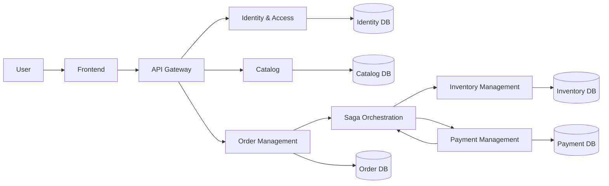
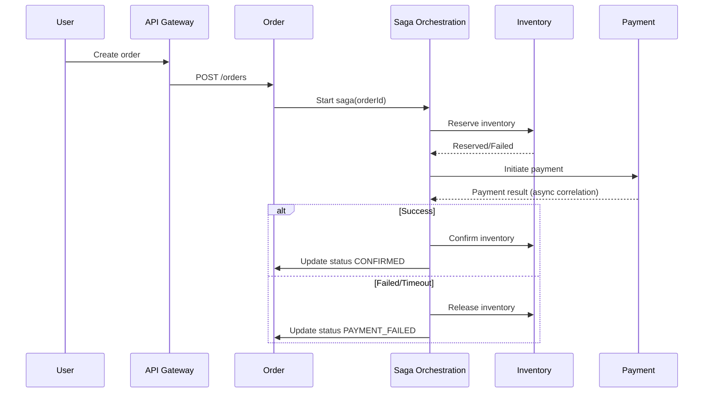

# System Architecture

> Tài liệu này được xây dựng từ kết quả phân tích nghiệp vụ và DDD, dùng để dẫn dắt triển khai.
> Nguồn tham chiếu chính: [analysis-and-design-ddd.md](analysis-and-design-ddd.md).

**References:**
1. *Service-Oriented Architecture: Analysis and Design for Services and Microservices* — Thomas Erl (2nd Edition)
2. *Microservices Patterns: With Examples in Java* — Chris Richardson
3. *Bài tập — Phát triển phần mềm hướng dịch vụ* — Hung Dang

---

## 1. Pattern Selection

| Pattern | Selected? | Business/Technical Justification |
|---------|-----------|----------------------------------|
| API Gateway | Yes | Cần điểm vào thống nhất cho client, tập trung cross-cutting concerns (auth, routing, rate-limit, logging). |
| Database per Service | Yes | Theo DDD, mỗi bounded context sở hữu dữ liệu riêng để đảm bảo autonomy và deploy độc lập. |
| Shared Database | No | Tránh coupling dữ liệu giữa các service để đảm bảo khả năng deploy độc lập. |
| Saga | Yes | Checkout là giao dịch phân tán giữa order/inventory/payment, cần orchestration + compensation thay vì distributed transaction. |
| Event-driven / Message Queue | Yes | Các bước bất đồng bộ (payment result, integration events) cần message-based communication để giảm coupling thời gian. |
| CQRS | Partial | Ưu tiên áp dụng cho các luồng đọc nhiều như product catalog; phần còn lại có thể dùng CRUD trước rồi tách dần. |
| Circuit Breaker | Yes | Bắt buộc cho các call liên service quan trọng để tránh cascading failures khi một service suy giảm. |
| Service Registry / Discovery | Yes | Cần cho môi trường scale-out và dynamic endpoint; tránh hardcoded URL. |
| Other: JWT + Blacklist | Yes | Cơ chế authn/authz thống nhất toàn hệ thống, hỗ trợ logout/invalidate token an toàn. |

---

## 2. System Components

### 2.1 Target Architecture (Theo DDD)

| Component | Responsibility | Tech Stack đề xuất | Port đề xuất |
|-----------|----------------|--------------------|-------------|
| **Frontend** | Giao diện người dùng, chỉ gọi qua API Gateway | React + Vite + Nginx | 3000 |
| **API Gateway** | Unified entry point, routing, auth filter, observability hooks | Spring Cloud Gateway | 8080 |
| **Identity & Access** | User lifecycle, authentication, token issuance/validation | Spring Boot + PostgreSQL + Redis + MQ | 8081 |
| **Catalog** | Public product queries, product management | Spring Boot + PostgreSQL | 8082 |
| **Order Management** | Create order, status transitions, timeline | Spring Boot + PostgreSQL | 8083 |
| **Inventory Management** | Reserve/confirm/release with idempotency | Spring Boot + PostgreSQL | 8084 |
| **Payment Management** | Payment initiation/result bridge, correlation trigger | Spring Boot + PostgreSQL | 8085 |
| **Saga Orchestration** | Điều phối checkout process và compensation path | Camunda 7/8 + Worker | 8086 |

### 2.2 Component Boundaries

| Bounded Context | Service | Data Ownership |
|-----------------|---------|----------------|
| Identity & Access | identity-service | users, tokens, blacklist |
| Catalog | product-service | products, categories |
| Order Management | order-service | orders, order_items, order_events |
| Inventory Management | inventory-service | inventory_items, reservations, inventory_history |
| Payment Management | payment-service | payments, payment_events |
| Saga Orchestration | orchestration-service | process state, workflow variables |

---

## 3. Communication

### 3.1 Target Inter-service Communication Matrix (DDD)

| From \ To | Gateway | Identity | Catalog | Order | Inventory | Payment | Orchestration |
|-----------|---------|----------|---------|-------|-----------|---------|---------------|
| **Frontend** | HTTP | - | - | - | - | - | - |
| **Gateway** | - | HTTP | HTTP | HTTP | HTTP | HTTP | - |
| **Order** | - | token introspection/claims | query product info | - | HTTP command | HTTP command | start process |
| **Inventory** | - | - | - | HTTP callback/update | - | - | external task/command |
| **Payment** | - | - | - | HTTP callback/update | - | - | message correlation |
| **Orchestration** | - | - | - | orchestrated task | orchestrated task | orchestrated task | - |

### 3.2 Communication Principles

1. Client chỉ giao tiếp với API Gateway.
2. Service-to-service dùng REST cho synchronous command/query ngắn.
3. Các bước bất đồng bộ trong checkout dùng event/message correlation.
4. Không dùng distributed transaction; dùng Saga orchestration + compensating action.
5. Mọi internal operation gây thay đổi trạng thái phải idempotent theo orderId/idempotency-key.

---

## 4. Architecture Diagram

### 4.1 Target DDD Runtime View

### 4.2 Checkout Saga Sequence (Target)

---

## 5. Deployment

### 5.1 Deployment Guidelines for Target Architecture

1. Thêm identity-service và product-service vào docker-compose với service DNS names (không dùng localhost giữa container).
2. Bổ sung order-service, inventory-service, payment-service, và Camunda orchestration runtime.
3. Mỗi service có endpoint `GET /health` trả `{"status":"ok"}` để đồng bộ health checking.
4. Cấu hình gateway route dùng tên service trong compose network, ví dụ:
   - `http://identity-service:8081`
   - `http://product-service:8082`
5. Tách database theo service hoặc schema tách biệt theo bounded context để giảm coupling.
6. Thiết lập MQ/broker cho các luồng bất đồng bộ (payment result, integration events).

### 5.2 Implementation Roadmap (From Analysis to Code)

| Phase | Deliverable | Exit Criteria |
|-------|-------------|---------------|
| 1 | Gateway + Identity + Catalog | Đăng ký/đăng nhập + product query đi qua gateway ổn định |
| 2 | Order + Inventory | Tạo order và reserve/confirm/release inventory có idempotency |
| 3 | Payment + Orchestration | Checkout end-to-end chạy theo saga với compensation |
| 4 | Hardening | Observability, retry policy, circuit breaker, performance tuning |

### 5.3 Risks and Mitigations

| Risk | Impact | Mitigation |
|------|--------|------------|
| Hardcoded service URL | Khó deploy đa môi trường | Dùng env + compose DNS + service discovery |
| Mất nhất quán dữ liệu phân tán | Sai trạng thái order/inventory/payment | Saga orchestration + idempotency + retry policy |
| Không xử lý timeout/partial failure | Treo flow checkout | Circuit breaker + timeout + compensation path |
| Message duplicate/out-of-order | Trùng xử lý nghiệp vụ | Idempotency key + deduplication + trạng thái bất biến |
