# Bookstore Microservice Architecture Diagrams

This document provides a focused diagram for each service in the system.

## 1) Staff Service (`staff`, host port `8000`)

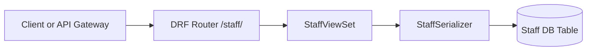

## 2) Manager Service (`manager`, host port `8001`)

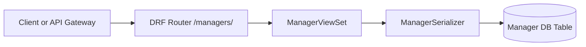

## 3) Customer Service (`customer`, host port `8002`)

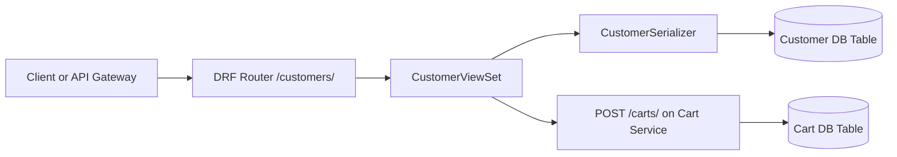

## 4) Catalog Service (`catalog`, host port `8003`)

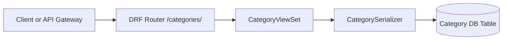

## 5) Book Service (`book`, host port `8004`)

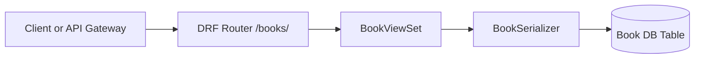

## 6) Cart Service (`cart`, host port `8005`)

```mermaid
flowchart LR
  A[Client or API Gateway] --> B[DRF Router /carts/]
  B --> C[CartViewSet]
  C --> D[CartSerializer + CartItemSerializer]
  D --> E[(Cart DB Table)]
  D --> F[(CartItem DB Table)]
  C --> G[Validate book_id via Book Service /books/{id}/]
```

## 7) Order Service (`order`, host port `8006`)

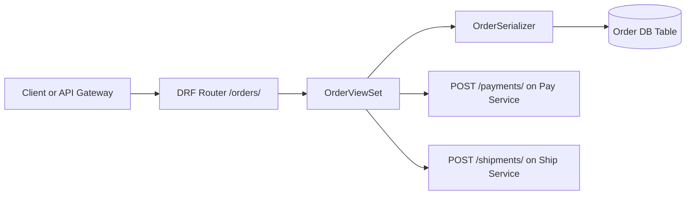

## 8) Ship Service (`ship`, host port `8007`)

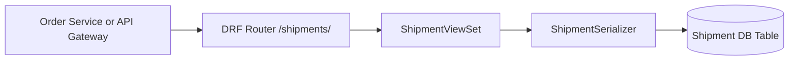

## 9) Pay Service (`pay`, host port `8008`)

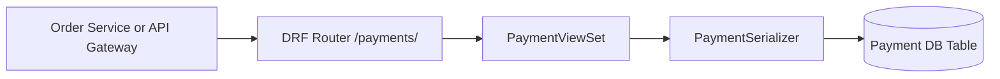

## 10) Comment-Rate Service (`comment-rate`, host port `8009`)

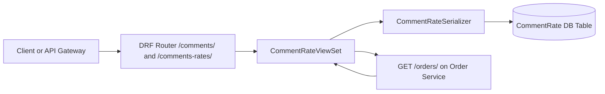

## 11) Recommender-AI Service (`recommender-ai`, host port `8010`)

```mermaid
flowchart LR
  A[Client or API Gateway] --> B[DRF Router /recommendations/]
  B --> C[RecommendationViewSet]
  C --> D[Score Engine in list()]
  D --> E[GET /orders/ on Order Service]
  D --> F[GET /comments-rates/ on Comment-Rate Service]
  C --> G[(Recommendation DB Table)]
```

## 12) API Gateway Service (`api-gateway`, host port `8011`)

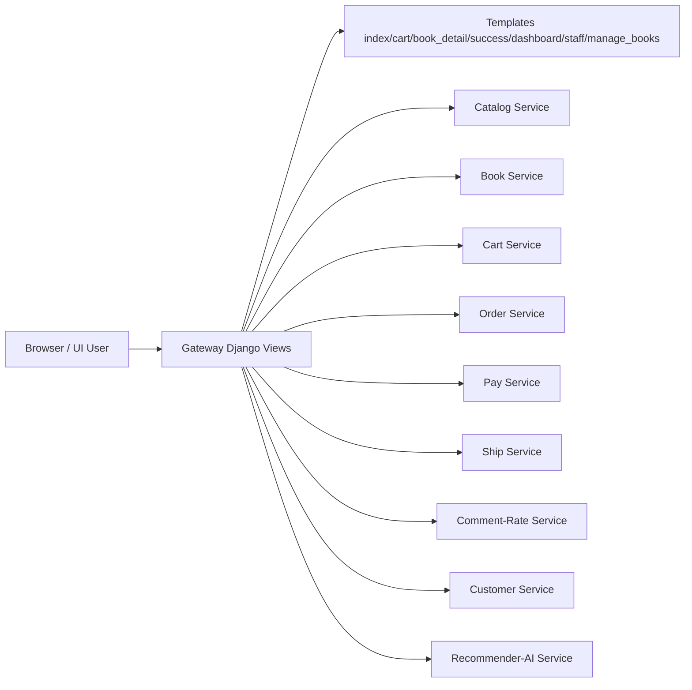

## End-to-End System Overview

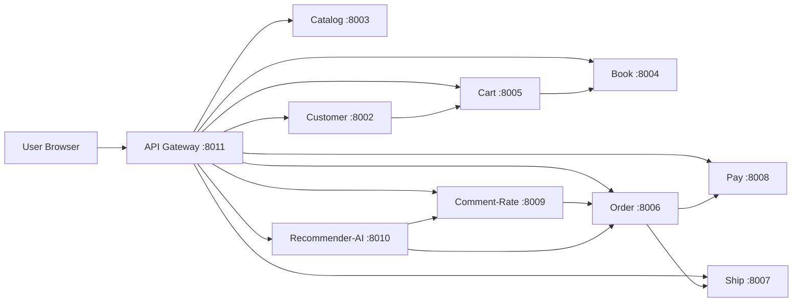
